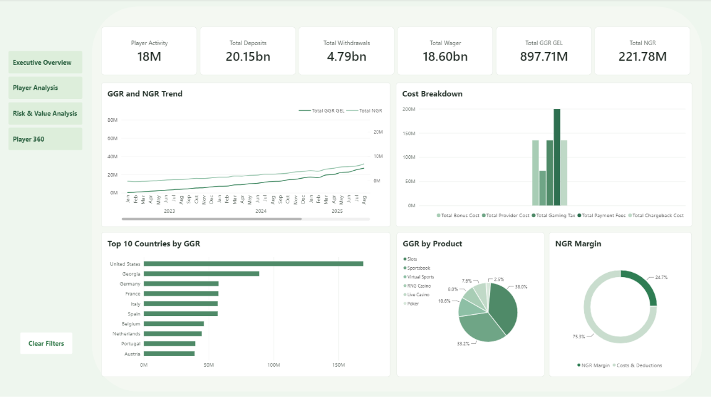
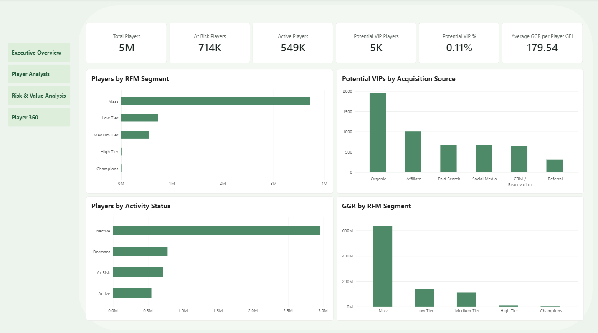
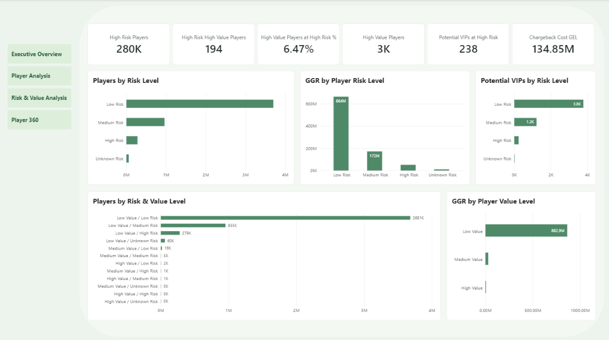
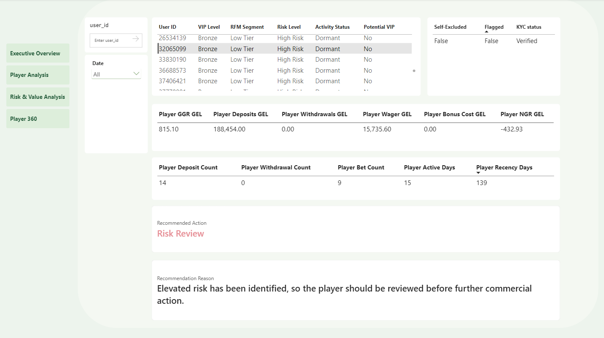

# iGaming Fraud & Risk Analytics

SQL + Power BI portfolio project focused on iGaming transaction analysis, player behavior, business performance and risk analytics.

## Project Overview

This project uses a synthetic iGaming analytical environment to demonstrate practical SQL, data modeling and Power BI skills in a fraud and risk context.

The model covers:

- Player and account activity
- Deposits, withdrawals and payment fees
- Bonus activity and bonus cost
- Gaming activity and GGR
- NGR and business performance
- Fraud and manual review indicators
- KYC and player risk segmentation
- Country, product and VIP analysis

No employer or production data is used in this repository.

## SQL Architecture

The SQL layer includes:

- Dimension and fact table design
- Foreign key relationships and integrity constraints
- Transaction and player-level analytical models
- Player-daily ETL
- Analytical SQL using subqueries and window functions
- Data-quality and business-rule validation
- Indexes for common analytical access patterns

### SQL Files

- [`database_schema.sql`](sql/database_schema.sql)  
  Core analytical database structure, relationships, constraints and indexes.

- [`player_daily_etl.sql`](sql/player_daily_etl.sql)  
  Stored procedure that aggregates wallet, gaming and bonus activity to player-date grain and supports player-level reporting.

- [`analytics_queries.sql`](sql/analytics_queries.sql)  
  Analytical queries using subqueries, CASE logic, ROW_NUMBER, RANK, DENSE_RANK, LAG and LEAD.

- [`data_quality_checks.sql`](sql/data_quality_checks.sql)  
  Validation checks covering duplicate records, date integrity, player registration rules and reporting consistency.

## Key Business Logic

### Gross Gaming Revenue

```text
GGR = Wager Amount - Payout Amount
```

### Net Gaming Revenue

The analytical model uses:

```text
NGR =
GGR
- Bonus Cost
- Payment Fees
- Provider Cost
- Gaming Tax
- Chargeback Cost
```

## Fraud & Risk Focus

The model includes fields and analytical logic related to:

- Fraud-flagged transactions
- Manual review activity
- Chargeback cost
- Payment declines
- KYC status
- Player risk segments
- Self-exclusion and responsible gaming indicators
- Bonus activity
- Transaction behavior

These components allow the project to be analyzed from both commercial and fraud/risk perspectives.

## Power BI

The Power BI reporting layer covers the overall iGaming business, combining commercial, player and risk-focused analysis.

### Executive Overview



Business-level KPIs and trends covering deposits, withdrawals, wagering, GGR, NGR, operating costs, country performance and product mix.

### Player Analysis



Player segmentation using RFM, activity status, potential VIP identification and acquisition-source analysis.

### Risk & Value Analysis



Risk and value segmentation combining player risk level, commercial value, GGR, potential VIP exposure and chargeback cost.

### Player 360



Player-level investigation view combining profile, KYC, risk, financial activity and recommended review action.

## Tools

`SQL Server` `Power BI` `Power Query` `DAX` `Excel`

## Repository Structure

```text
igaming-fraud-risk-analytics/
│
├── screenshots/
│   ├── executive-overview.png
│   ├── player-analysis.png
│   ├── risk-value-analysis.png
│   └── player-360-risk-review.png
│
├── sql/
│   ├── README.md
│   ├── database_schema.sql
│   ├── player_daily_etl.sql
│   ├── analytics_queries.sql
│   └── data_quality_checks.sql
│
└── README.md
```

## Portfolio Purpose

This project demonstrates how SQL and Power BI can be applied to iGaming business analysis, player behavior, payment activity and fraud/risk monitoring.
